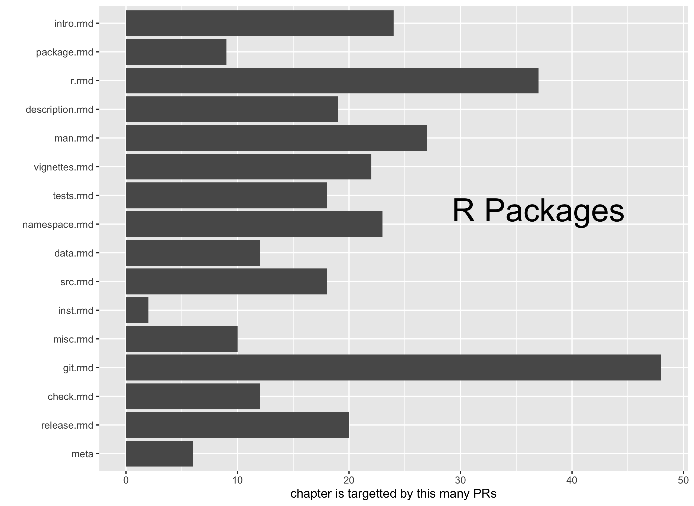
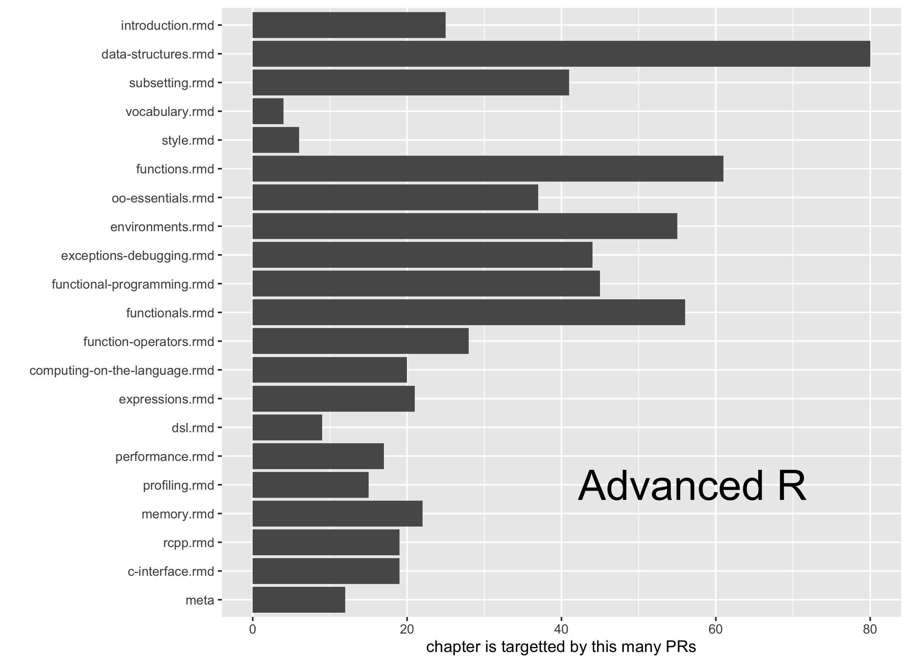

How to obtain a bunch of GitHub issues or pull requests with R
==============================================================

I want to make [`purrr`](https://github.com/hadley/purrr) and [`dplyr`](https://github.com/hadley/dplyr) and [`tidyr`](https://github.com/hadley/tidyr) play nicely with each other. How can I use `purrr` for iteration, while still using `dplyr` and `tidyr` to manage the data frame side of of the house?

Three motivating examples, where I marshal data from the GitHub API using the excellent [`gh` package](https://github.com/gaborcsardi/gh):

-   In [STAT 545](http://stat545-ubc.github.io), 10% of the course mark is awarded for engagement. I want to use contributions to the course [Discussion](https://github.com/STAT545-UBC/Discussion/issues) as a primary input here. This is how I fell down this rabbit hole in the first place.
-   Oliver Keyes [tweeted](https://twitter.com/quominus/status/670398322696392705) that he wanted "a script that goes through all my GitHub repositories and generates a list of which ones have open issues". How could I resist this softball? Sure, there are [easier ways to do this](https://twitter.com/millerdl/status/670430991278858240), but why not use R?
-   Jordan Ellenberg, [writing for the Wall Street Journal](http://www.wsj.com/articles/the-summers-most-unread-book-is-1404417569), used Amazon's "Popular Highlights" feature to define the **Hawking Index**:

    > Take the page numbers of a book's five top highlights, average them, and divide by the number of pages in the whole book. The higher the number, the more of the book we're guessing most people are likely to have read.

    I mean, how many people really stick with "A Brief History of Time" to the bitter end? I was reading through Hadley Wickham's [Advanced R](http://adv-r.had.co.nz) when I read Jordan's article and wondered ... how many people read this entire book? Or do they start and sort of fizzle out? So I wanted to look at the distribution of pull requests. Are they evenly distributed throughout the book or do they cluster in the early chapters?

This is a glorified note-to-self. It might be interesting to a few other people. But I presume a lot of experience with R and a full-on embrace of `%>%`, `dplyr`, etc.

-   [Oliver's open issues](#olivers-open-issues)
-   [Pull requests on a repo](#pull-requests-on-a-repo)
-   [Issue threads](#issue-threads)

### Oliver's open issues

Let's start with the easiest task: does have Oliver issues? If so, can we be more specific?

First, load packages. Install `gh` and `purrr` from GitHub, if necessary. `gh` is not on CRAN and `purrr` is under active development; I doubt my code code would work with CRAN version.

``` r
# install_github("gaborcsardi/gh")
# install_github("hadley/purrr")
library(gh)
suppressPackageStartupMessages(library(dplyr))
suppressPackageStartupMessages(library(purrr))
```

Use `gh()` to retrieve all of Oliver's public GitHub repositories.

``` r
repos <- gh("/users/ironholds/repos", .limit = Inf)
length(repos)
#> [1] 48
```

Create a data frame with one row per repo and two variables.

-   `repo` = repository name. Use `purrr::map_chr()` to extract all elements named `name` from the repository list. The map functions are much like base `lapply()` or `vapply()`. There is a lot of flexibility around how to specify the function to apply over the input list. Here I use a shortcut: the character vector `"name"` is converted into an extractor function.
-   `issue` = list-column of the issues for each repository. Again, I use a map function, in this case to provide vectorization for `gh()`. I use a different shortcut: the `~` formula syntax creates an anonymous function on-the-fly, where `.x` stands for "the input".

``` r
iss_df <-
  data_frame(
    repo = repos %>% map_chr("name"),
    issue = repo %>%
      map(~ gh(repo = .x, endpoint = "/repos/ironholds/:repo/issues",
               .limit = Inf))
    )
str(iss_df, max.level = 1)
#> Classes 'tbl_df', 'tbl' and 'data.frame':    48 obs. of  2 variables:
#>  $ repo : chr  "arin" "averageimage" "batman" "billund" ...
#>  $ issue:List of 48
```

Create a decent display of how many open issues there are on each repo. I use `map_int()` to count the open issues for each repo and then standard `dplyr` verbs to select, filter, and arrange. I'm not even bothering with `knitr::kable()` here because these experiments are definitely not about presentation.

``` r
iss_df %>%
  mutate(n_open = issue %>% map_int(length)) %>%
  select(-issue) %>%
  filter(n_open > 0) %>%
  arrange(desc(n_open)) %>%
  print(n = nrow(.))
#> Source: local data frame [13 x 2]
#> 
#>              repo n_open
#>             (chr)  (int)
#> 1  passbypromised      7
#> 2   distributions      5
#> 3          driver      5
#> 4        practice      3
#> 5      rgeolocate      2
#> 6        urltools      2
#> 7          primes      1
#> 8         protein      1
#> 9            rope      1
#> 10       webreadr      1
#> 11      WikidataR      1
#> 12      WikipediR      1
#> 13            wmf      1
```

A clean script for this is available in [open-issue-count-by-repo.R](open-issue-count-by-repo.R).

### Pull requests on a repo

*Even though it was [Advanced R](http://adv-r.had.co.nz) that got me thinking about this, I first started playing around with [R Packages](http://r-pkgs.had.co.nz), which happens to have 50% fewer PRs than Advanced R. But I've done this for both books and present a script and figure for each at the end of this example.*

Load packages. Even more this time.

``` r
library(gh)
suppressPackageStartupMessages(library(dplyr))
library(tidyr)
suppressPackageStartupMessages(library(purrr))
library(curl)
suppressPackageStartupMessages(library(readr))
```

Use `gh()` to retrieve all pull requests on [`hadley/r-pkgs`](https://github.com/hadley/r-pkgs).

``` r
owner <- "hadley"
repo <- "r-pkgs"
pr_list <-
  gh("/repos/:owner/:repo/pulls", owner = owner, repo = repo,
     state = "all", .limit = Inf)
length(pr_list)
#> [1] 295
```

Define a little helper function that [won't be necessary forever](https://github.com/hadley/purrr/issues/110), but is useful below when we dig info out of `pr_list`.

``` r
map_chr_hack <- function(.x, .f, ...) {
  map(.x, .f, ...) %>%
    map_if(is.null, ~ NA_character_) %>%
    flatten_chr()
}
```

Use `map_*()` functions to extract and data-frame-ize the potentially useful parts of the pull request list. I'm extracting much more than I ultimately use, which betrays how overly optimistic I was when I started. So far I can't figure out how to use the API to directly compare two commits, but I haven't given up yet.

``` r
pr_df <- pr_list %>%
{
  data_frame(number = map_int(., "number"),
             id = map_int(., "id"),
             title = map_chr(., "title"),
             state = map_chr(., "state"),
             user = map_chr(., c("user", "login")),
             commits_url = map_chr(., "commits_url"),
             diff_url = map_chr(., "diff_url"),
             patch_url = map_chr(., "patch_url"),
             merge_commit_sha = map_chr_hack(., "merge_commit_sha"),
             pr_HEAD_label = map_chr(., c("head", "label")),
             pr_HEAD_sha = map_chr(., c("head", "sha")),
             pr_base_label = map_chr(., c("base", "label")),
             pr_base_sha = map_chr(., c("base", "sha")),
             created_at = map_chr(., "created_at") %>% as.Date(),
             closed_at = map_chr_hack(., "closed_at") %>% as.Date(),
             merged_at = map_chr_hack(., "merged_at") %>% as.Date())
}
pr_df
#> Source: local data frame [295 x 16]
#> 
#>    number       id                                             title
#>     (int)    (int)                                             (chr)
#> 1     327 51398771                `.rda` extension is case sensitive
#> 2     326 48678175          modified git command for deleting branch
#> 3     324 47463575                                  Update tests.rmd
#> 4     323 47457827                                    Update man.rmd
#> 5     322 47344525 slightly modified in the "Binary builds" section.
#> 6     320 43412833                     removed extraneous word "are"
#> 7     319 43271518                                      Fixing typos
#> 8     318 42719902                         Homogenize LaTeX spelling
#> 9     317 42078372          Merge pull request #1 from scw/git-typos
#> 10    316 42037653                        Fix small typos in src.Rmd
#> ..    ...      ...                                               ...
#> Variables not shown: state (chr), user (chr), commits_url (chr), diff_url
#>   (chr), patch_url (chr), merge_commit_sha (chr), pr_HEAD_label (chr),
#>   pr_HEAD_sha (chr), pr_base_label (chr), pr_base_sha (chr), created_at
#>   (date), closed_at (date), merged_at (date).
```

I want to know which files are affected by each PR. If I had all this stuff locally, I would do [something like this](http://stackoverflow.com/questions/1552340/how-to-list-the-file-names-only-that-changed-between-two-commits):

``` shell
git diff --name-only SHA1 SHA2
```

I have to emulate that with the GitHub API. It seems the [compare two commits feature](https://developer.github.com/v3/repos/commits/#compare-two-commits) only works for two branches or two tags, but not two arbitrary SHAs. Please enlighten me and answer [this question on StackOverflow](http://stackoverflow.com/questions/26925312/github-api-how-to-compare-2-commits) if you know how to do this.

My current workaround is to get info on the diff associated with a pull request from its associated patch file. We've already stored these URLs in the `pr_df` data frame. You can read my rather hacky helper function, [`get_pr_affected_files_from_patch()`](get-pr-affected-files-from-patch.R), if you wish, but I'll just source it here.

``` r
source("get-pr-affected-files-from-patch.R")
```

Add a list-column to the data frame of pull requests. It holds one data frame per PR, with info on the file changes. We use `map()` again and also use `dplyr` and `purrr` together here, in order to preserve association between the existing PR info and the modified files. *This takes around 4 minutes for me FYI.*

``` r
pr_df <- pr_df %>%
    mutate(pr_files = patch_url %>% map(get_pr_affected_files_from_patch))
```

Sanity check the `pr_files` list-column. First, look at an example element. We have one row per file and two variables: `file` and `diffstuff` (currently I do nothing with this but ...). Do all elements of the list-column have exactly two variables? What's the distribution of the number of rows? I expect to see that the vast majority of PRs affect exactly 1 file, because there are lots of typo corrections.

``` r
pr_df$pr_files[[69]]
#> Source: local data frame [2 x 2]
#> 
#>          file     diffstuff
#>         (chr)         (chr)
#> 1     man.rmd 10 +++++-----
#> 2 package.rmd        4 ++--
pr_df$pr_files %>% map(dim) %>% do.call(rbind, .) %>% apply(2, table)
#> [[1]]
#> 
#>   0   1   2   6 
#>   1 285   8   1 
#> 
#> [[2]]
#> 
#>   2 
#> 295
```

Simplify the list-column elements from data frame to character vector. Then use `tidyr::unnest()` to "explode" things, i.e. give each element its own row. Each row is now a file modified in a PR.

``` r
nrow(pr_df)
#> [1] 295
pr_df <- pr_df %>%
  mutate(pr_files = pr_files %>% map("file")) %>%
  unnest(pr_files)
nrow(pr_df)
#> [1] 307
```

Write `pr_df` out to file, omitting lots of the variables I currently have no use for.

``` r
pr_df %>%
  select(number, id, title, state, user, pr_files) %>%
  write_csv("r-pkgs-pr-affected-files.csv")
```

Here's a figure depicting how often each chapter has been the target of a pull request. I'm not adjusting for length of the chapter or anything, so take it with a huge grain of salt. But there's no obvious evidence that people read and edit the earlier chapters more. We like to make suggestions about Git apparently!.



Recap of files related to PRs on R Packages

-   script to marshal data: [r-pkgs-pr-affected-files.R](r-pkgs-pr-affected-files.R)
-   ready-to-analyze data: [r-pkgs-pr-affected-files.csv](r-pkgs-pr-affected-files.csv)
-   barchart: [r-pkgs-pr-affected-files-barchart.png](r-pkgs-pr-affected-files-barchart.png)
-   script to make barchart: [r-pkgs-pr-affected-files-figs.R](r-pkgs-pr-affected-files-figs.R)

I went through the same steps with all pull requests on [`hadley/adv-r`](https://github.com/hadley/adv-r), the repository for [Advanced R](http://adv-r.had.co.nz).

Here's the same figure as above but for Advanced R. There's a stronger case for earlier chapters being targeted with PRs more often.



Recap of files related to PRs on Advanced R:

-   script to marshal data: [adv-r-pr-affected-files.R](adv-r-pr-affected-files.R)
-   ready-to-analyze data: [adv-r-pr-affected-files.csv](adv-r-pr-affected-files.csv)
-   barchart: [adv-r-pr-affected-files-barchart.png](adv-r-pr-affected-files-barchart.png)
-   script to make barchart: [adv-r-pr-affected-files-figs.R](adv-r-pr-affected-files-figs.R)

### Issue threads

[STAT 545](http://stat545-ubc.github.io) has a public Discussion repo, where we use the issues as a discussion board. I want to look at the posts there, as something related to student engagement that I can actually quantify.

This starts out fairly similar to the previous example: I retrieve all issues that have been modified since September 1, 2015.

``` r
owner <- "STAT545-UBC"
repo <- "Discussion"

issue_list <-
  gh("/repos/:owner/:repo/issues", owner = owner, repo = repo,
     state = "all", since = "2015-09-01T00:00:00Z", .limit = Inf)
(n_iss <- length(issue_list))
#> [1] 212
```

This retrieves 212 issues. I use this list to create a conventional data frame with one row per issue.

``` r
issue_df <- issue_list %>%
{
  data_frame(number = map_int(., "number"),
             id = map_int(., "id"),
             title = map_chr(., "title"),
             state = map_chr(., "state"),
             n_comments = map_int(., "comments"),
             opener = map_chr(., c("user", "login")),
             created_at = map_chr(., "created_at") %>% as.Date())
}
issue_df
#> Source: local data frame [212 x 7]
#> 
#>    number        id                                        title  state
#>     (int)     (int)                                        (chr)  (chr)
#> 1     276 119601582 Creating PDFs via latex in command line/make   open
#> 2     275 119272439                   general makefile confusion closed
#> 3     274 119262468                     do is dropping countries closed
#> 4     273 119259601        linear regression within each country closed
#> 5     272 119257920                       adding another column? closed
#> 6     271 119252407               how to add the residual error? closed
#> 7     270 119236992                        Pandoc error solution   open
#> 8     269 119230359                             how many scripts closed
#> 9     268 119133218          Can't download packages from github   open
#> 10    267 119112488                          using gapminder.tsv closed
#> ..    ...       ...                                          ...    ...
#> Variables not shown: n_comments (int), opener (chr), created_at (date).
```

It turns out some of these issues were created during the 2014 run but show up here because I closed them in early September. Get rid of them.

``` r
issue_df <- issue_df %>%
  filter(created_at >= "2015-09-01T00:00:00Z")
(n_iss <- nrow(issue_df))
#> [1] 192
```

Down to 192 issues.

My ultimate goal is a data frame with one row per issue comment, but it's harder than you expect to get there. Each issue should be represented by at least one row and many will have several rows, as there are typically follow up comments.

I need to loop over the issues and retrieve the follow up comments. I mean that literally -- the [Issue Comment endpoint](https://developer.github.com/v3/issues/comments/) does not return a comment for the opening of the issue. This makes for a little extra data manipulation ... and more practice with `purrr` and `dplyr`!

Make a data frame of issue "opens" with a set of variables chosen for maximum bliss in future binds and joins. The `i` variable records comment position within the thread.

``` r
opens <- issue_df %>%
  select(number, who = opener) %>%
  mutate(i = 0L)
opens
#> Source: local data frame [192 x 3]
#> 
#>    number             who     i
#>     (int)           (chr) (int)
#> 1     276      samhinshaw     0
#> 2     275 molliejmcdowell     0
#> 3     274 molliejmcdowell     0
#> 4     273 molliejmcdowell     0
#> 5     272        bdacunha     0
#> 6     271        bdacunha     0
#> 7     270          zhamel     0
#> 8     269 molliejmcdowell     0
#> 9     268         wang114     0
#> 10    267        bdacunha     0
#> ..    ...             ...   ...
nrow(opens)
#> [1] 192
```

Make a data frame of issue follow up comments. At first, this has to hold an unfriendly list-column `res` where I dump issue comments as returned by the API.

``` r
comments <- issue_df %>%
  select(number) %>%
  mutate(res = number %>% map(
    ~ gh(number = .x,
         endpoint = "/repos/:owner/:repo/issues/:number/comments",
         owner = owner, repo = repo, .limit = Inf)))
str(comments, max.level = 1)
#> Classes 'tbl_df', 'tbl' and 'data.frame':    192 obs. of  2 variables:
#>  $ number: int  276 275 274 273 272 271 270 269 268 267 ...
#>  $ res   :List of 192
#>   .. [list output truncated]
```

What is the `res` variable? A list-column of length 192, each component of which is another list of comments, each of which is also a nested list. Here's a look at 3 elements corresponding to issues that generated anywhere from no discussion to lots of discussion.

``` r
comments %>%
  filter(number %in% c(275, 273, 272)) %>%
  select(res) %>%
  walk(str, max.level = 2, give.attr = FALSE)
#> List of 3
#>  $ :List of 2
#>   ..$ :List of 8
#>   ..$ :List of 8
#>  $ : list()
#>  $ :List of 6
#>   ..$ :List of 8
#>   ..$ :List of 8
#>   ..$ :List of 8
#>   ..$ :List of 8
#>   ..$ :List of 8
#>   ..$ :List of 8
```

All I really want to know is *who* made the comment, so I mutate `res` into `who` using `map_chr()` and a character vector as extractor function. Push this one level down in the `res` nested list. I can drop the nasty `res` variable and revisit the same threads above to show how much simpler things have gotten.

``` r
comments <- comments %>%
  mutate(who = res %>% map(. %>% map_chr(c("user", "login")))) %>%
  select(-res)
comments %>%
  filter(number %in% c(275, 273, 272))
#> Source: local data frame [3 x 2]
#> 
#>   number      who
#>    (int)   (list)
#> 1    275 <chr[2]>
#> 2    273 <chr[0]>
#> 3    272 <chr[6]>
```

Use `tidyr::unnest()` to "explode" the `who` list-column and get one row per follow up comment. I now add the `i` variable for numbering within the thread.

``` r
comments <- comments %>%
  unnest(who) %>%
  group_by(number) %>%
  mutate(i = row_number(number)) %>%
  ungroup()
comments
#> Source: local data frame [863 x 3]
#> 
#>    number             who     i
#>     (int)           (chr) (int)
#> 1     275         jennybc     1
#> 2     275 molliejmcdowell     2
#> 3     274          ksamuk     1
#> 4     274 molliejmcdowell     2
#> 5     272         jennybc     1
#> 6     272         jennybc     2
#> 7     272        bdacunha     3
#> 8     272         jennybc     4
#> 9     272         jennybc     5
#> 10    272        bdacunha     6
#> ..    ...             ...   ...
```

No more list-columns!

It's time for a sanity check. Do the empirical counts of follow up comments match the number of comments initially reported by the API?

``` r
count_empirical <- comments %>%
  count(number)
count_stated <- issue_df %>%
  select(number, stated = n_comments)
checker <- left_join(count_empirical, count_stated)
#> Joining by: "number"
with(checker, n == stated) %>% all() # hopefully TRUE
#> [1] TRUE
```

I row bind issue "opens" and follow up comments, feeling very smug that that they have exactly the same variables, though it is no accident.

``` r
atoms <- bind_rows(opens, comments)
```

Join back to the original data frame of issues, since that still holds issue title, state and creation date. It is intentional that the `number` variable has been set up as the natural `by` variable.

``` r
finally <- atoms %>%
  left_join(issue_df) %>%
  select(number, id, opener, who, i, everything()) %>%
  arrange(desc(number), i)
#> Joining by: "number"
```

A quick look at this and ... we're ready for analysis. Our work here is done.

``` r
finally
#> Source: local data frame [1,055 x 9]
#> 
#>    number        id          opener             who     i
#>     (int)     (int)           (chr)           (chr) (int)
#> 1     276 119601582      samhinshaw      samhinshaw     0
#> 2     275 119272439 molliejmcdowell molliejmcdowell     0
#> 3     275 119272439 molliejmcdowell         jennybc     1
#> 4     275 119272439 molliejmcdowell molliejmcdowell     2
#> 5     274 119262468 molliejmcdowell molliejmcdowell     0
#> 6     274 119262468 molliejmcdowell          ksamuk     1
#> 7     274 119262468 molliejmcdowell molliejmcdowell     2
#> 8     273 119259601 molliejmcdowell molliejmcdowell     0
#> 9     272 119257920        bdacunha        bdacunha     0
#> 10    272 119257920        bdacunha         jennybc     1
#> ..    ...       ...             ...             ...   ...
#> Variables not shown: title (chr), state (chr), n_comments (int),
#>   created_at (date).
finally %>%
  count(who, sort = TRUE)
#> Source: local data frame [71 x 2]
#> 
#>            who     n
#>          (chr) (int)
#> 1      jennybc   311
#> 2     ahippman    63
#> 3  cathyxijuan    49
#> 4     daattali    48
#> 5       ksamuk    47
#> 6     bdacunha    42
#> 7      LinaQiu    24
#> 8     mstrimas    23
#> 9         npjc    22
#> 10      sho-87    22
#> ..         ...   ...
#write_csv(finally, "stat545-discussion-threads.csv")
```

A clean script for this example is in [stat545-discussion-threads.R](stat545-discussion-threads.R).

------------------------------------------------------------------------

Thanks to [`@hadley`](https://github.com/hadley) and [`@lionel-`](https://github.com/lionel-) for patiently answering all of my `purrr` questions. There have been many.

------------------------------------------------------------------------

``` r
devtools::session_info()
#> Session info --------------------------------------------------------------
#>  setting  value                       
#>  version  R version 3.2.2 (2015-08-14)
#>  system   x86_64, darwin13.4.0        
#>  ui       X11                         
#>  language (EN)                        
#>  collate  en_CA.UTF-8                 
#>  tz       America/Vancouver           
#>  date     2015-12-01
#> Packages ------------------------------------------------------------------
#>  package    * version    date       source                       
#>  assertthat   0.1        2013-12-06 CRAN (R 3.2.0)               
#>  curl       * 0.9.3      2015-08-25 CRAN (R 3.2.0)               
#>  DBI          0.3.1      2014-09-24 CRAN (R 3.2.0)               
#>  devtools     1.9.1.9000 2015-11-16 local                        
#>  digest       0.6.8      2014-12-31 CRAN (R 3.2.0)               
#>  dplyr      * 0.4.3.9000 2015-11-24 Github (hadley/dplyr@4f2d7f8)
#>  evaluate     0.8        2015-09-18 CRAN (R 3.2.0)               
#>  formatR      1.2.1      2015-09-18 CRAN (R 3.2.0)               
#>  gh         * 1.0.0      2015-11-27 local                        
#>  htmltools    0.2.6      2014-09-08 CRAN (R 3.2.0)               
#>  httr         1.0.0      2015-06-25 CRAN (R 3.2.0)               
#>  jsonlite     0.9.17     2015-09-06 CRAN (R 3.2.0)               
#>  knitr        1.11.16    2015-11-23 Github (yihui/knitr@6e8ce0c) 
#>  lazyeval     0.1.10     2015-01-02 CRAN (R 3.2.0)               
#>  magrittr     1.5        2014-11-22 CRAN (R 3.2.0)               
#>  memoise      0.2.1      2014-04-22 CRAN (R 3.2.0)               
#>  purrr      * 0.1.0.9000 2015-11-24 Github (hadley/purrr@7d41ee9)
#>  R6           2.1.1      2015-08-19 CRAN (R 3.2.0)               
#>  Rcpp         0.12.2     2015-11-15 CRAN (R 3.2.2)               
#>  readr      * 0.2.2      2015-10-22 CRAN (R 3.2.0)               
#>  rmarkdown    0.8.1      2015-10-10 CRAN (R 3.2.2)               
#>  rstudioapi   0.3.1      2015-04-07 CRAN (R 3.2.0)               
#>  stringi      1.0-1      2015-10-22 CRAN (R 3.2.0)               
#>  stringr      1.0.0      2015-04-30 CRAN (R 3.2.0)               
#>  tidyr      * 0.3.1.9000 2015-11-09 Github (hadley/tidyr@c714c72)
#>  yaml         2.1.13     2014-06-12 CRAN (R 3.2.0)
```
